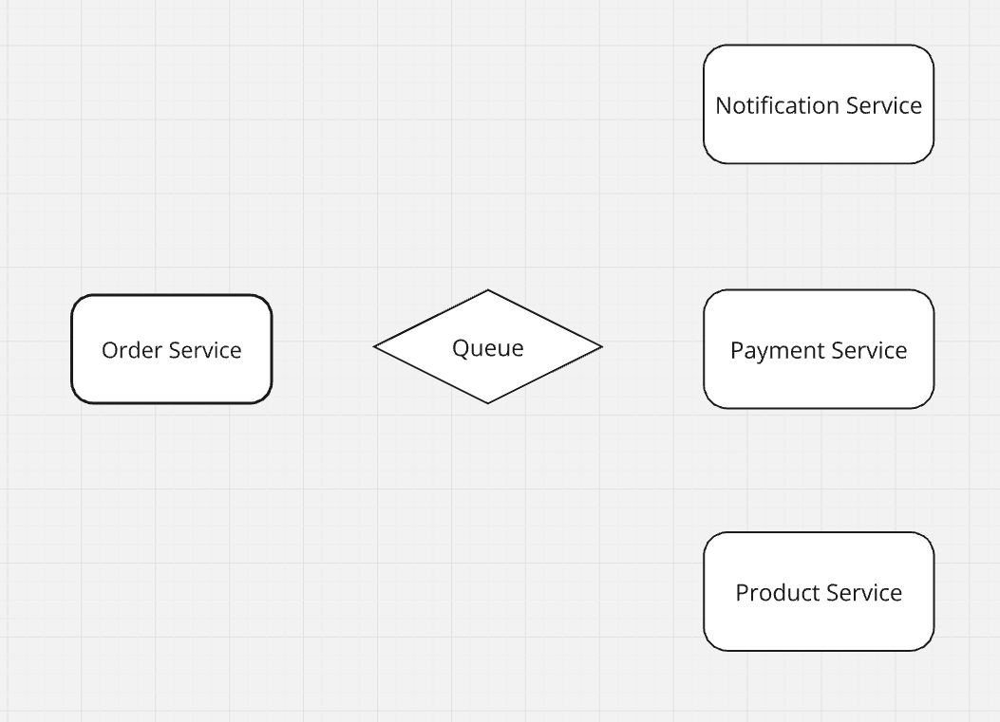

### TODO 
<input type="checkbox" disabled /> Dockerize

<input type="checkbox" disabled /> Add CI/CD

# E-commerce App

This is a POC for an e-commerce app. 

This app contains four services:

- Order Service

- Product Service

- Payment Service

- Notification Service 

Each service is an independent service and can be run independently.

### Order Service

| Method | URL                               | Action                                      |
|--------|-----------------------------------|---------------------------------------------|
| `GET`  | `/order`                          | Get all orders                              |
| `GET`  | `/order/{id}`                     | Get order by order ID                       |
| `GET`  | `/order/{id}/payment/status`      | Update payment status                       |
| `POST` | `/order`                          | Create a new order                          |
| `POST` | `/order/{id}/cancel`              | Cancel order                                |

### Product Service

| Method  | URL                              | Action                                      |
|---------|----------------------------------|---------------------------------------------|
| `GET`   | `/product`                       | Get all products                            |
| `GET`   | `/product/{id}`                  | Get product by product ID                   |
| `GET`   | `/product/{id}/stock`            | Get product stock                           |
| `POST`  | `/product`                       | Create a new product                        |
| `PUT`   | `/product/{id}`                  | Update product                              |
| `DELETE`| `/product/{id}`                  | Delete product                              |

### Payment Service

| Method  | URL                              | Action                                      |
|---------|----------------------------------|---------------------------------------------|
| `GET`   | `/payment`                       | Get all payments                            |
| `GET`   | `/payment/{id}`                  | Get payment by payment ID                   |
| `GET`   | `/payment/{id}/status`           | Get payment status                          |
| `POST`  | `/payment/{id}/status/webhook`   | Payment webhook                             |

### Notification Service

| Method  | URL                              | Action                                      |
|---------|----------------------------------|---------------------------------------------|
| `GET`   | `/notification`                  | Get all notifications                       |
| `GET`   | `/notification/{id}`             | Get notification by notification ID         |
| `POST`  | `/notification`                  | Send a new notification                     |
